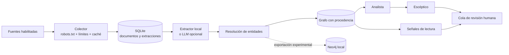

<p align="center">
  
</p>

# Red Privada

[](https://github.com/alejandrojlamas/red-privada/actions/workflows/ci.yml)
[](LICENSE)
[](pyproject.toml)
[](#estado-del-proyecto)

**Cartografía de evidencia para investigación asistida.**

Red Privada es un laboratorio personal de IA aplicada para explorar relaciones entre entidades
en corpus de interés público. Reúne únicamente fuentes habilitadas por el operador, conserva la
procedencia de cada relación y ordena pistas para una revisión humana informada.

> [!IMPORTANT]
> **Un mapa no es un veredicto.** Una coaparición no demuestra relación, intención, causalidad ni
> responsabilidad. Los resultados son rutas de lectura, no conclusiones automatizadas.

El nombre rinde un homenaje independiente a **Manuel Buendía**, autor de la columna periodística
*Red Privada*, y al rigor técnico y ético con el que ejerció el oficio. La
[UNAM documenta ese legado](https://www.dgcs.unam.mx/boletin/bdboletin/2021_503.html). Este
proyecto no está afiliado con su familia, fundación, archivos, medios ni titulares de derechos.

## Qué hace

- Recolecta fuentes públicas autorizadas con caché, límites de descarga por fuente y política
  cerrada de `robots.txt`.
- Extrae entidades y relaciones con citas textuales obligatorias y validación mediante Pydantic.
- Resuelve identidades por alias configurados y similitud textual conservadora.
- Construye un grafo idempotente donde cada arista se puede rastrear hasta su documento, URL y
  fragmento de evidencia.
- Prioriza conexiones mediante independencia de fuentes, modelo nulo, especificidad y
  concentración temporal.
- Genera señales exploratorias de baja atención y novedad estructural para orientar lectura.
- Ejecuta el flujo local completo sobre SQLite y permite una exportación experimental a Neo4j.

## Principios de diseño

| Principio | Invariante |
| --- | --- |
| Procedencia antes que persuasión | Toda relación conserva evidencia rastreable. |
| IA bajo control | El extractor local es predeterminado; un proveedor externo exige activación explícita. |
| Escepticismo incorporado | Una conexión llamativa también puede ser repetición o sesgo del corpus. |
| Fuentes por activación explícita | No hay fuentes de red activas por defecto. |
| Revisión humana | El sistema organiza evidencia; no acusa, certifica ni decide. |

## Cómo se construye el mapa



### Los roles del sistema

- **Colector:** obtiene solo fuentes habilitadas y aplica límites de acceso.
- **Extractor:** propone entidades y relaciones respaldadas por fragmentos textuales.
- **Resolutor:** agrupa alias configurados y coincidencias textuales conservadoras.
- **Cartógrafo:** convierte las relaciones resueltas en un grafo reproducible.
- **Analista:** encuentra nodos puente que merecen lectura.
- **Escéptico:** degrada coincidencias débiles, correlacionadas o previsibles.

El comando `run` y los análisis `discover`, `score` y `signals` trabajan de punta a punta sobre
SQLite. El motor Neo4j recibe una exportación del grafo; los análisis posteriores continúan
leyendo SQLite y no existe sincronización bidireccional.

## Primer recorrido seguro

Requisitos: Python 3.11+, [`uv`](https://docs.astral.sh/uv/) y, únicamente para Neo4j, Docker.

```bash
git clone https://github.com/alejandrojlamas/red-privada.git
cd red-privada
cp .env.example .env
make install
make test
```

El proyecto arranca en modo seguro: todas las fuentes de red están deshabilitadas, el extractor
es local y SQLite es el motor. Las pruebas no necesitan credenciales ni internet.

Para ejecutar una recolección real:

1. Revisa términos, copyright y política de automatización de cada fuente.
2. Cambia `enabled: true` solo en entradas autorizadas de `config/sources.yaml`.
3. Define `RED_PRIVADA_USER_AGENT` con una URL de contacto real que controles.
4. Carga el entorno y ejecuta el flujo.

```bash
set -a
source .env
set +a

make ingest
make extract
make graph
make discover
make score
make signals
```

`make run` encadena el flujo SQLite completo. Sin fuentes activas ni documentos almacenados,
produce colas vacías de manera intencional.

## Resultados para revisión

Los nombres técnicos se mantienen estables para facilitar automatizaciones:

| Archivo | Contenido |
| --- | --- |
| `bridge_candidates.json` | Entidades puente, evidencia y dictamen del Escéptico. |
| `skeptic_reports.json` | Independencia, modelo nulo, especificidad y señal temporal. |
| `small_notes.json` | Documentos de atención relativa baja con novedad estructural. |
| `morning_readings.json` | Posibles ausencias o correcciones textuales en la ventana oficial. |
| `signals.json` | Salida combinada de las señales de lectura. |

Consulta [el método de puntuación](docs/SCORING.md), [las señales](docs/SIGNALS.md) y
[el esquema del grafo](docs/GRAPH_SCHEMA.md).

## Extracción opcional con IA

`llm.provider: dev` es el valor predeterminado y nunca llama a un servicio externo. Reconoce solo
las entidades configuradas y genera co-menciones conservadoras.

<details>
<summary>Activar DeepSeek de forma explícita</summary>

```yaml
llm:
  provider: "deepseek"
```

```bash
export DEEPSEEK_API_KEY="..."
make extract
```

Con `provider: deepseek`, el sistema transmite al endpoint configurado parte del documento,
además de identificadores técnicos, URL y etiqueta de fuente. Revisa las condiciones, residencia
y retención del proveedor antes de utilizar material sensible. `provider: auto` también existe,
pero selecciona DeepSeek cuando detecta `DEEPSEEK_API_KEY`; úsalo solo si aceptas esa decisión
implícita.

Las relaciones propuestas por DeepSeek cuyo predicado no sea la coaparición canónica se guardan
como `inference`: permanecen visibles para revisión, pero no reciben bonificaciones de
especificidad ni de novedad estructural.

</details>

## Neo4j experimental

Los puertos se publican únicamente en `127.0.0.1`; el repositorio no contiene contraseñas ni
valores predecibles de respaldo.

```bash
openssl rand -base64 32
# Copia el resultado en NEO4J_PASSWORD dentro de .env.
docker compose config >/dev/null
docker compose up -d neo4j
```

Después carga `.env`, cambia `graph.backend: neo4j` y ejecuta `make graph`. Exponer Neo4j fuera
del equipo requiere controles adicionales de red, TLS, autenticación y copias de seguridad que
este proyecto no configura.

La exportación a Neo4j es incremental y no reconciliada: después de corregir o volver a extraer
un documento puede conservar relaciones de una exportación anterior. Para obtener una
instantánea limpia, utiliza una base o un volumen dedicado nuevo; no apuntes esta función a una
base compartida con datos ajenos al proyecto.

## Fuentes, permisos y `robots.txt`

Las fuentes incluidas son ejemplos deshabilitados. Su presencia no afirma que la automatización
siga permitida. Si `robots.txt` falta, no contiene reglas utilizables o no puede consultarse, Red
Privada bloquea la descarga. El ajuste `project.allow_robots_unavailable: true` está reservado
para una fuente propia o con autorización expresa y nunca evita un `Disallow` válido ni una
respuesta 401/403.

Cumplir `robots.txt` no sustituye términos, licencia ni permiso. El proyecto no debe emplearse
para evadir autenticación, muros de pago o controles de acceso. La licencia Apache-2.0 cubre este
código y su documentación original; no concede derechos sobre corpus de terceros.

## Datos locales y retención

El proyecto guarda, sin cifrado ni caducidad automática:

- respuestas descargadas en `data/cache/`;
- documentos, metadatos y extracciones en SQLite;
- reportes JSON en `data/output/`;
- datos del contenedor en los volúmenes de Neo4j, si se habilita.

Estas rutas están excluidas de Git, pero siguen bajo responsabilidad del operador. No introduzcas
credenciales, corpus confidenciales ni datos personales en incidencias, pruebas o *commits*.

## Límites y uso responsable

- No verifica por sí mismo la verdad, actualidad ni contexto completo de un documento.
- Una fuente etiquetada como distinta no es necesariamente independiente.
- Una ausencia textual no implica silencio deliberado.
- La centralidad de un nodo puede reflejar popularidad o sesgo de muestreo.
- La extracción local no descubre entidades abiertas fuera del catálogo configurado.
- Los límites de descarga no convierten el recolector en un *sandbox*; ejecuta fuentes no
  confiables en un entorno aislado y supervisado.
- No debe utilizarse para decisiones adversas sobre personas.

## Compatibilidad técnica

La distribución y el comando principales son `red-privada`; `python -m red_privada` ofrece el
punto de entrada por módulo. Durante la serie `0.x` se conservan `evidence-graph` y
`python -m evidence_graph_lab` como alias compatibles. Las versiones anteriores siguen siendo
legibles y las migraciones aditivas de SQLite se aplican automáticamente; los consumidores deben
tratar el esquema y los campos JSON como una interfaz alfa todavía evolutiva.

## Estado del proyecto

Red Privada está en fase **alfa**. El flujo local SQLite está probado; las fuentes externas,
DeepSeek y Neo4j requieren configuración y validación del operador en su propio entorno. No hay
servicio alojado, interfaz web ni corpus incluido.

```bash
make test
make lint
make build
```

La integración continua valida Python 3.11 y 3.12. Consulta [CONTRIBUTING.md](CONTRIBUTING.md)
antes de proponer cambios y [SECURITY.md](SECURITY.md) para informar vulnerabilidades.

## Por qué se llama Red Privada

Manuel Buendía convirtió su columna *Red Privada* en una referencia del periodismo de
investigación mexicano. Este proyecto toma su nombre como homenaje al oficio de reconstruir
relaciones con técnica, contexto, trazabilidad y criterio editorial.

El homenaje se limita al nombre y a esos principios. La identidad visual es original y no
reproduce retratos, firmas, columnas, facsímiles, cabeceras, citas ni materiales de archivo. Red
Privada es un proyecto independiente, sin patrocinio ni respaldo institucional.

## Licencia

[Apache License 2.0](LICENSE). Se aplica al software y a la documentación original del
repositorio, no al contenido recolectado de terceros.
