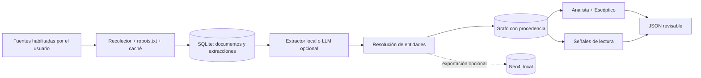

# Red Privada

[](https://github.com/alejandrojlamas/Red-privada/actions/workflows/ci.yml)
[](LICENSE)
[](pyproject.toml)

Motor reproducible para explorar relaciones entre entidades en corpus de interés público. Red
Privada recolecta fuentes elegidas por el usuario, conserva la procedencia de cada relación y
prioriza pistas mediante análisis de grafos y controles contra asociaciones espurias.

El proyecto está orientado a investigación asistida: entrega evidencia trazable y colas de
lectura, no afirmaciones de culpabilidad ni conclusiones periodísticas automatizadas.

## Qué aporta

- Recolección responsable con caché, límites por fuente y verificación de `robots.txt`.
- Extracción estructurada con citas textuales obligatorias y validación Pydantic.
- Resolución de identidades por alias y similitud; embeddings locales opcionales.
- Grafo idempotente donde cada arista conserva documento, URL y fragmento de evidencia.
- Priorización antiapofenia mediante independencia de fuentes, modelo nulo, especificidad y
  concentración temporal.
- Señales exploratorias de baja atención, novedad estructural y contraste con un corpus oficial.
- SQLite para el flujo local completo y exportación opcional del grafo a Neo4j.

## Arquitectura



El comando `run` y los análisis `discover`, `score` y `signals` trabajan de punta a punta sobre
SQLite. Si `graph.backend` se cambia a `neo4j`, el comando `graph` exporta entidades y relaciones
a Neo4j; los análisis posteriores siguen leyendo SQLite. La implementación actual no sincroniza
ambos backends automáticamente.

## Inicio rápido seguro

Requisitos: Python 3.11+, [`uv`](https://docs.astral.sh/uv/) y, solo para Neo4j, Docker.

```bash
git clone https://github.com/alejandrojlamas/Red-privada.git
cd Red-privada
cp .env.example .env
make install
make test
```

El repositorio arranca en modo seguro: todas las fuentes de red están deshabilitadas, el extractor
es local y SQLite es el backend. Las pruebas no necesitan credenciales ni acceso a internet.

Para ejecutar recolección real:

1. Revise los términos, el copyright y la política de automatización de cada fuente.
2. Edite `config/sources.yaml` y cambie `enabled: true` solo en las fuentes autorizadas.
3. Configure en `.env` un `RED_PRIVADA_USER_AGENT` descriptivo con una URL de contacto real. El
   ejemplo apunta al repositorio y no contiene un correo personal.
4. Cargue las variables y ejecute el pipeline.

```bash
set -a
source .env
set +a

make ingest
make extract
make graph
make discover
make score
make signals
```

También puede usar `make run` para encadenar el flujo SQLite completo. Si ninguna fuente está
habilitada y no hay documentos previos, producirá colas de lectura vacías de forma intencional.

## Uso opcional de un LLM

`llm.provider: dev` es el valor predeterminado y no llama a servicios externos: reconoce solo las
entidades configuradas y crea co-menciones conservadoras. Para usar DeepSeek de forma explícita:

```yaml
llm:
  provider: "deepseek"
```

```bash
export DEEPSEEK_API_KEY="..."
make extract
```

Con `provider: deepseek`, el sistema transmite al endpoint configurado hasta
`max_chars_per_document` caracteres del texto, además del identificador y hash del documento, la
URL y `source_side`. Revise las condiciones, residencia y retención del proveedor antes de usarlo
con material sensible. `provider: auto` también existe, pero selecciona DeepSeek cuando encuentra
`DEEPSEEK_API_KEY`; úselo solo si acepta esa selección implícita.

## Neo4j opcional

Los puertos de Neo4j se publican únicamente en `127.0.0.1`. No existe una contraseña incluida ni
un valor predecible de respaldo.

```bash
openssl rand -base64 32
# Pegue el resultado en NEO4J_PASSWORD dentro de .env.
docker compose config >/dev/null
docker compose up -d neo4j
```

Después cargue `.env`, cambie `graph.backend: neo4j` y ejecute `make graph`. Docker Compose falla
de forma deliberada si `NEO4J_PASSWORD` está vacía o ausente. Exponer Neo4j fuera del equipo
requiere controles adicionales de red, TLS, autenticación y copias de seguridad que este proyecto
no configura.

## Recolección, `robots.txt` y fuentes

Las entradas de `config/sources.yaml` son ejemplos y están deshabilitadas. Activarlas es una
decisión opt-in del operador; su presencia en el archivo no afirma que el acceso automatizado siga
permitido.

Si `robots.txt` no existe, está vacío, no contiene reglas utilizables o falla la consulta, Red
Privada bloquea la descarga. `project.allow_robots_unavailable: true` permite continuar únicamente
ante esa indisponibilidad y debe reservarse para una fuente propia o con autorización expresa. El
override nunca evita una regla `Disallow` válida ni una respuesta HTTP 401/403.

Cumplir `robots.txt` no sustituye los términos del sitio, una licencia o el permiso del titular.
No use el proyecto para evadir autenticación, paywalls o controles de acceso. La licencia
Apache-2.0 cubre el código de este repositorio; no concede derechos sobre artículos, feeds, citas o
corpus de terceros. Mantenga atribución, límites razonables y una base jurídica adecuada para su
uso.

## Datos locales y retención

El proyecto guarda, sin cifrado ni caducidad automática:

- respuestas descargadas en `data/cache/`;
- texto, metadatos y extracciones en `data/state/red_privada.sqlite`;
- reportes JSON en `data/output/`;
- datos del contenedor en los volúmenes `neo4j_data` y `neo4j_logs`, si se usa Neo4j.

Esas rutas están excluidas de Git, pero siguen siendo responsabilidad del operador. Para eliminar
los datos SQLite y los artefactos del proyecto, cierre procesos en ejecución y borre únicamente
`data/cache/`, `data/state/` y `data/output/`. Los volúmenes de Docker requieren una operación
separada y no se eliminan al detener el contenedor.

## Salidas y revisión humana

- `bridge_candidates.json`: entidades-puente ordenadas, evidencia y dictamen del Escéptico.
- `skeptic_reports.json`: independencia, modelo nulo, especificidad y señal temporal.
- `small_notes.json`: documentos de baja atención relativa con novedad estructural.
- `morning_readings.json`: posibles ausencias o correcciones textuales en la ventana oficial.
- `signals.json`: resultado combinado de las señales de lectura.

Consulte [el método de scoring](docs/SCORING.md), [las señales](docs/SIGNALS.md) y
[el esquema del grafo](docs/GRAPH_SCHEMA.md).

Toda salida requiere revisión humana contra la fuente original. Una co-mención no demuestra una
relación; un nodo central puede reflejar popularidad o sesgo de muestreo; fuentes con etiquetas
distintas no son necesariamente independientes; y una ausencia textual no implica silencio
deliberado. El sistema no comprueba por sí mismo la veracidad, actualidad o contexto completo de
cada documento y no debe usarse para decisiones adversas sobre personas.

## Desarrollo

```bash
make test
make lint
```

La integración continua ejecuta ambas validaciones en Python 3.11 y 3.12. Los reportes de
vulnerabilidades se gestionan según [SECURITY.md](SECURITY.md).

## Licencia

[Apache License 2.0](LICENSE). Esta licencia se aplica al software y a la documentación propia del
repositorio, no al contenido recolectado de terceros.
