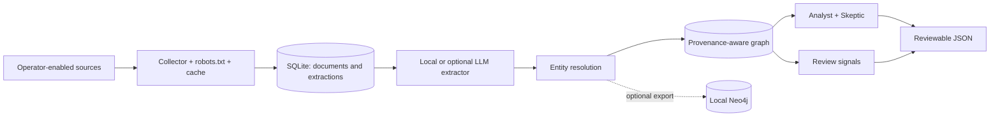

# Evidence Graph Lab

[](https://github.com/alejandrojlamas/evidence-graph-lab/actions/workflows/ci.yml)
[](LICENSE)
[](pyproject.toml)

A reproducible applied-AI research lab for exploring relationships between entities in
public-interest corpora. Evidence Graph Lab collects operator-approved sources, preserves
provenance for every relationship, and prioritizes research leads through graph analysis and
controls against spurious associations.

The project is designed for AI-assisted research: it produces traceable evidence and review
queues—not allegations, declarations of guilt, or automated journalistic conclusions.

## What it provides

- Responsible collection with caching, per-source limits, and `robots.txt` enforcement.
- Structured extraction with mandatory verbatim quotes and Pydantic validation.
- Alias- and similarity-based identity resolution, with optional local embeddings.
- An idempotent graph where every edge retains its document, URL, and evidence excerpt.
- Anti-apophenia ranking based on source independence, a null model, specificity, and temporal
  concentration.
- Exploratory signals for low-attention documents, structural novelty, and comparison with an
  official corpus.
- SQLite for the complete local workflow, plus optional graph export to Neo4j.

## Architecture



The `run` command and the `discover`, `score`, and `signals` analyses operate end to end on
SQLite. When `graph.backend` is set to `neo4j`, the `graph` command exports resolved entities and
relationships to Neo4j; later analyses still read SQLite. The current implementation does not
automatically synchronize the two backends.

## Safe quick start

Requirements: Python 3.11+, [`uv`](https://docs.astral.sh/uv/), and Docker only if you choose
Neo4j.

```bash
git clone https://github.com/alejandrojlamas/evidence-graph-lab.git
cd evidence-graph-lab
cp .env.example .env
make install
make test
```

The repository starts in a safe mode: every network source is disabled, the extractor is local,
and SQLite is the backend. Tests require neither credentials nor internet access.

To run real collection:

1. Review each source's terms, copyright, and automation policy.
2. Edit `config/sources.yaml` and set `enabled: true` only for authorized sources.
3. Set `EVIDENCE_GRAPH_USER_AGENT` in `.env` to a descriptive value with a real contact URL. The
   example points to this repository and contains no personal email address.
4. Load the environment and run the pipeline.

```bash
set -a
source .env
set +a

make ingest
make extract
make graph
make discover
make score
make signals
```

You can also use `make run` to execute the complete SQLite workflow. If no source is enabled and
there are no stored documents, the pipeline intentionally produces empty review queues.

## Optional LLM extraction

`llm.provider: dev` is the default and never calls an external service. It recognizes only the
configured entities and creates conservative co-mentions. To explicitly use DeepSeek:

```yaml
llm:
  provider: "deepseek"
```

```bash
export DEEPSEEK_API_KEY="..."
make extract
```

With `provider: deepseek`, the system sends up to `max_chars_per_document` characters of the
document text to the configured endpoint, along with the document identifier and hash, URL, and
`source_side`. Review the provider's terms, residency, and retention policies before using
sensitive material. `provider: auto` is also available, but it selects DeepSeek whenever
`DEEPSEEK_API_KEY` is present; use it only if you accept that implicit choice.

## Optional Neo4j backend

Neo4j ports bind only to `127.0.0.1`. The repository includes neither a password nor a predictable
fallback value.

```bash
openssl rand -base64 32
# Paste the result into NEO4J_PASSWORD in .env.
docker compose config >/dev/null
docker compose up -d neo4j
```

Then load `.env`, set `graph.backend: neo4j`, and run `make graph`. Docker Compose deliberately
fails when `NEO4J_PASSWORD` is empty or missing. Exposing Neo4j beyond the local machine requires
additional network controls, TLS, authentication, and backups that this project does not
configure.

## Collection, `robots.txt`, and sources

The entries in `config/sources.yaml` are disabled examples. Enabling one is an explicit operator
decision; its presence does not claim that automated access remains permitted.

If `robots.txt` is missing, empty, unusable, or unavailable, Evidence Graph Lab blocks the
download. `project.allow_robots_unavailable: true` permits collection only in that unavailable
state and should be reserved for a source you own or are explicitly authorized to access. The
override never bypasses a valid `Disallow` rule or an HTTP 401/403 response.

Complying with `robots.txt` does not replace site terms, a license, or permission from the rights
holder. Do not use this project to bypass authentication, paywalls, or access controls. The
Apache-2.0 license covers this repository's code; it grants no rights to third-party articles,
feeds, quotes, or corpora. Preserve attribution, reasonable rate limits, and a suitable legal
basis for your use.

## Local data and retention

The project stores the following without encryption or automatic expiration:

- downloaded responses in `data/cache/`;
- text, metadata, and extractions in `data/state/evidence_graph_lab.sqlite`;
- JSON reports in `data/output/`;
- container data in the `neo4j_data` and `neo4j_logs` volumes when Neo4j is used.

These paths are excluded from Git but remain the operator's responsibility. To remove SQLite data
and project artifacts, stop running processes and delete only `data/cache/`, `data/state/`, and
`data/output/`. Docker volumes require a separate operation and are not deleted when the container
stops.

## Outputs and human review

- `bridge_candidates.json`: ranked bridge entities, evidence, and the Skeptic's verdict.
- `skeptic_reports.json`: independence, null-model, specificity, and temporal-signal details.
- `small_notes.json`: low-attention documents with structural novelty.
- `morning_readings.json`: possible absences or textual corrections in the official window.
- `signals.json`: the combined review-signal output.

See the [scoring method](docs/SCORING.md), [review signals](docs/SIGNALS.md), and
[graph schema](docs/GRAPH_SCHEMA.md).

Every output requires human review against the original source. A co-mention does not prove a
relationship; a central node may reflect popularity or sampling bias; differently labeled sources
are not necessarily independent; and textual absence does not imply deliberate silence. The
system does not independently verify the truth, currency, or full context of a document and must
not be used to make adverse decisions about people.

## Command and package compatibility

The public distribution is `evidence-graph-lab`, the primary command is `evidence-graph`, and
`python -m evidence_graph_lab` provides the module entry point. The historical `red-privada`
command and `red_privada` implementation package remain available as compatibility aliases for
early users. New command-line integrations should use the Evidence Graph Lab names.

If you want to continue using an existing pre-rename database, set `project.database_path` to
`data/state/red_privada.sqlite` in your local configuration. The new default uses
`data/state/evidence_graph_lab.sqlite`.

## Development

```bash
make test
make lint
make build
```

Continuous integration runs the checks on Python 3.11 and 3.12. Vulnerability reports follow
[SECURITY.md](SECURITY.md).

## License

[Apache License 2.0](LICENSE). It applies to the software and original documentation in this
repository, not to collected third-party content.
